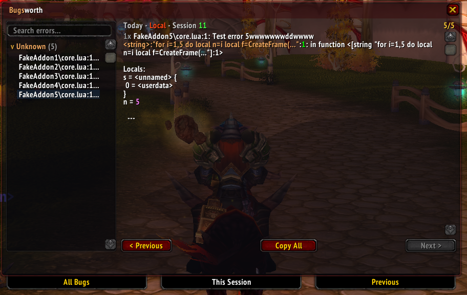

# Bugsworth

  

All-in-one Lua error handler for WoW 3.3.5a. Captures, deduplicates, and persists every Lua error with a two-panel viewer, per-addon grouping, and one-click export.

Built on `!BugGrabber` (r154) and `BugSack` (r225), extended with SavedVariables persistence, accordion navigation, search, ignore lists, and more.

## Features

- Intercepts all Lua errors via `seterrorhandler` hook
- Deduplicates per session · throttles at 20/sec to prevent runaway loops
- Groups errors by source addon with hit counts
- Two-panel viewer: addon navigation on the left, syntax-highlighted detail on the right
- Search/filter across all errors and addon names
- Per-addon ignore list (right-click in viewer, `/bugs ignore`, or settings panel)
- Copy All button for easy bug reports
- Export to SavedVariable for sharing (`/bugs export`)
- Minimap button with error count badge
- Suppresses the default Blizzard error popup (configurable)
- Full `BugGrabber` callback compatibility — addons listening for `BugGrabber_BugGrabbed` still work

## Commands

| Command | Description |
|---|---|
| `/bugs` | Open the viewer |
| `/bugs count` | Error summary |
| `/bugs last [N]` | Print last N errors to chat |
| `/bugs clear` | Wipe all errors |
| `/bugs config` | Open settings |
| `/bugs export` | Export errors to `BugsworthExport` SavedVariable |
| `/bugs ignore [addon]` | Ignore an addon's errors |
| `/bugs unignore [addon]` | Stop ignoring |
| `/bugs help` | Show all commands |

## Minimap Button

| Action | Effect |
|---|---|
| Click | Open/close viewer |
| Shift-click | Reload UI |
| Alt-click | Wipe all errors |
| Right-click | Open settings |

The icon turns red and shows a count badge when errors are present.

## Viewer Layout

**Left panel** — Addons with errors, sorted by frequency. Click to expand/collapse individual errors. Click an error to view it. Right-click an addon to ignore it.

**Right panel** — Full error detail with syntax highlighting, Previous/Next navigation, and Copy All.

**Tabs** — *This Session* (default), *All Bugs*, or *Previous* sessions.

## Settings

Accessible via `/bugs config` or right-clicking the minimap button:

- Auto-open on error · Chat notification · Mute sound
- Filter taint errors · Throttle toggle
- Error limit (10–1000)
- Suppress default error popup
- Ignored addons list

## Migrating from Other Error Addons

Bugsworth replaces all of the following. Remove or disable them to avoid conflicts:

| Addon | Status |
|---|---|
| `!BugGrabber` / `BugGrabber` | Fully merged — remove |
| `BugSack` | Fully merged — remove |
| `!Swatter` | Auto-disabled by Bugsworth, but cleaner to remove |
| `ImprovedErrorFrame` | Unnecessary — Bugsworth suppresses the default popup |
| `ErrorMonster` | Redundant — remove |

Addons that depend on `BugGrabber`'s API will continue to work through Bugsworth's built-in compatibility shim.

## Notes

- The `!` prefix in the folder name ensures Bugsworth loads first alphabetically, hooking the error handler before any addon can throw errors.
- Errors persist via SavedVariables at `WTF/Account/<ACCOUNT>/SavedVariables/Bugsworth.lua`. Data is flushed on logout, exit, or `/reload` — not on crash.
- Use `/bugs export` then `/reload` to generate a shareable error report in the same SavedVariables file.

## License

GPL v2-or-later — inherited from the upstream [BugGrabber](https://github.com/Beast-Masters-addons/BugGrabber) addon.

Original code © 2005 Rowne and Ramble · Contributions © 2009 Rabbit · Bugsworth © 2026 Mathisto. See [LICENSE](LICENSE) for full terms.
